# Smart Attendance System — Mermaid Diagrams
**Ghana Communication Technology University (GCTU)**
*Chapter 3 – System Specification and Design*

---

## 1. System Architecture Diagram

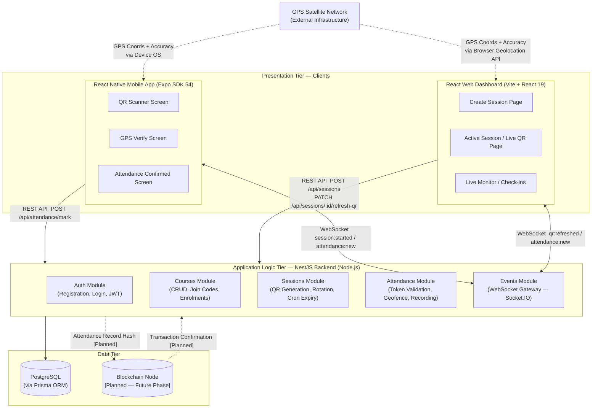

---

## 2. Use Case Diagram

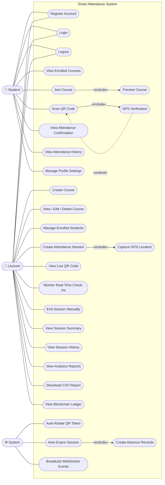

---

## 3. Context Diagram — DFD Level 0

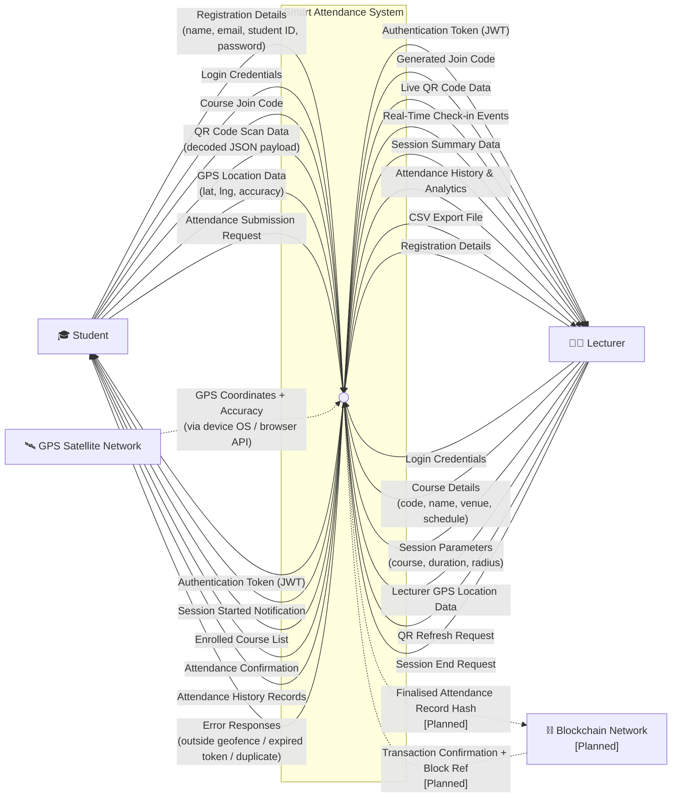

---

## 4. DFD Level 1 (Diagram 0 — Major Processes)

```mermaid
graph TB
    Student["🎓 Student"]
    Lecturer["👨‍🏫 Lecturer"]
    GPS["🛰️ GPS Satellite Network"]
    BC["⛓️ Blockchain Network\n[Planned]"]

    D1[("D1: Users")]
    D2[("D2: Courses")]
    D3[("D3: Enrolments")]
    D4[("D4: Sessions")]
    D5[("D5: Attendance Records")]
    D6[("D6: Absence Records")]

    P1["1\nUser Authentication\n& Account Management"]
    P2["2\nCourse & Enrolment\nManagement"]
    P3["3\nSession & QR Code\nManagement"]
    P4["4\nAttendance Verification\n& Recording"]
    P5["5\nReporting & History"]
    P6["6\nReal-Time Event Distribution\n(WebSocket Gateway)"]
    P7["7\nAutomated Session Lifecycle\nManagement (Scheduler)"]

    %% Auth flows
    Student -->|"Registration Details / Login Credentials"| P1
    Lecturer -->|"Registration Details / Login Credentials"| P1
    P1 <-->|"Read / Write User Records"| D1
    P1 -->|"Authentication Token"| Student
    P1 -->|"Authentication Token"| Lecturer

    %% Course flows
    Lecturer -->|"Course Details"| P2
    Student -->|"Course Join Code"| P2
    P2 <-->|"Read / Write Courses"| D2
    P2 <-->|"Read / Write Enrolments"| D3
    P2 -->|"Generated Join Code"| Lecturer
    P2 -->|"Course Preview / Enrolment Confirmation"| Student

    %% Session / QR flows
    Lecturer -->|"GPS Location Data + Session Parameters"| P3
    Lecturer -->|"QR Refresh Request / Session End Request"| P3
    P3 <-->|"Read / Write Session Records"| D4
    P3 -->|"Live QR Code Data"| Lecturer
    P3 -->|"Session Lifecycle Events"| P6

    %% Attendance flows
    Student -->|"QR Scan Data + GPS Location Data"| P4
    P4 -->|"Read Session (tokens, geofence)"| D4
    P4 -->|"Read Enrolment"| D3
    P4 -->|"Read / Write Attendance Records"| D5
    P4 -->|"Attendance Confirmation / Error Response"| Student
    P4 -->|"Attendance-New Event"| P6

    %% Reporting flows
    Lecturer -->|"History / Report Requests"| P5
    Student -->|"Attendance History Request"| P5
    P5 -->|"Read Sessions"| D4
    P5 -->|"Read Attendance"| D5
    P5 -->|"Read Absences"| D6
    P5 -->|"History, Analytics, CSV Export"| Lecturer
    P5 -->|"Personal Attendance History"| Student

    %% WebSocket gateway
    P6 -->|"session:started / qr:refreshed / attendance:new / session:ended"| Student
    P6 -->|"attendance:new / qr:refreshed / session:ended"| Lecturer

    %% Scheduler
    P7 -->|"Read Active Sessions (by duration)"| D4
    P7 -->|"Update Session Status → ENDED"| D4
    P7 -->|"Read Enrolments"| D3
    P7 -->|"Read Attendance (to find absentees)"| D5
    P7 -->|"Write Absence Records"| D6
    P7 -->|"Session-Ended Event"| P6

    %% GPS
    GPS -.->|"Coordinates + Accuracy"| P3
    GPS -.->|"Coordinates + Accuracy"| P4

    %% Blockchain (planned)
    P4 -.->|"Finalised Record Hash [Planned]"| BC
```

---

## 5. DFD Level 2 — QR Code Generation & Validation (Process 3 Expansion)

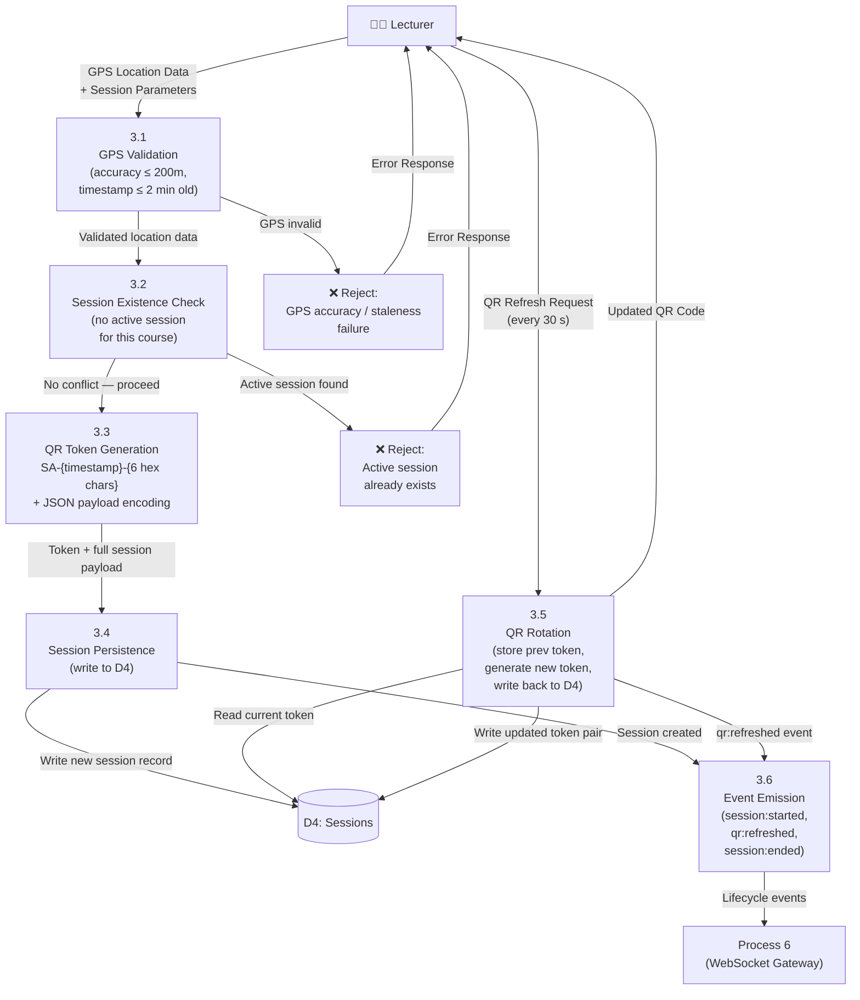

---

## 6. DFD Level 2 — GPS Geofence Verification (Process 4 — GPS Sub-flow)

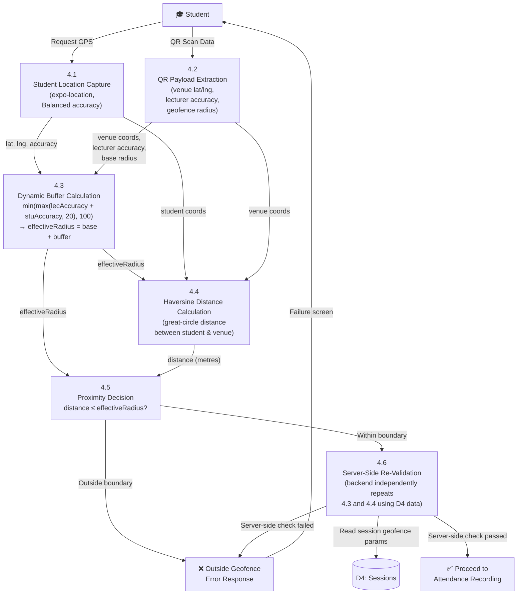

---

## 7. DFD Level 2 — Attendance Recording (Process 4 — Recording Sub-flow)

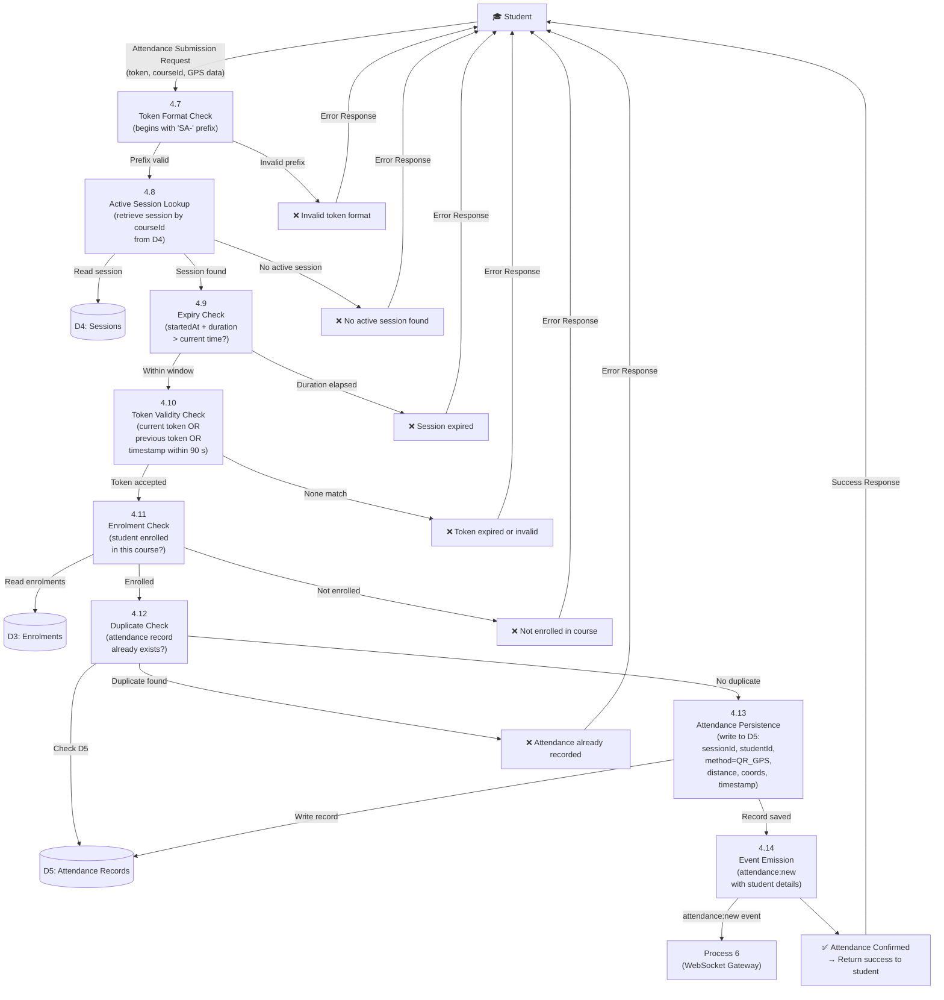

---

## 8. Flowchart 1 — Student Attendance Registration

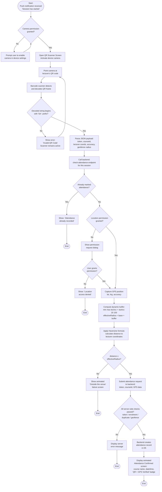

---

## 9. Flowchart 2 — Lecturer Session Creation & QR Code Generation

```mermaid
flowchart TD
    A([Start:\nLecturer navigates to\n'Create Session' page]) --> B[Page initiates automatic GPS capture\n3 samples averaged via\nbrowser Geolocation API]
    B --> C{GPS capture succeeded\nwithin 30 seconds?}
    C -- No --> D[Show error:\nRetry or check\nlocation permissions]
    D --> B
    C -- Yes --> E{GPS accuracy\n≤ 200 metres?}
    E -- No --> F[Show warning:\n'Accuracy too low —\nwait or move location']
    F --> B
    E -- Yes --> G[System check panel confirms:\nbackend reachable ✓\nGPS ready ✓]
    G --> H[Lecturer selects course,\nsets duration,\nadjusts geofence radius]
    H --> I[Lecturer clicks\n'Start Session']
    I --> J[POST /api/sessions:\ncourseId, duration, radius,\nGPS coords, accuracy]
    J --> K{Backend: GPS coords\nstale? timestamp > 2 min?}
    K -- Yes --> L[Reject:\n'GPS data stale —\nplease recapture']
    L --> B
    K -- No --> M{Active session\nalready exists\nfor this course?}
    M -- Yes --> N[Reject:\n'Session already active']
    N --> H
    M -- No --> O[Backend generates QR token:\nSA-{timestamp}-{6 hex}\nPersist session in D4]
    O --> P[Broadcast\n'session:started'\nWebSocket event\nto course room]
    P --> Q[Dashboard navigates to\nActive Session Page\nQR code rendered via qrcode.react]
    Q --> R[Start 30-second\ncountdown timer]
    R --> S{Timer reaches zero?}
    S -- No --> T{Lecturer clicks\n'End Session'?}
    T -- No --> S
    S -- Yes --> U[Call PATCH\n/api/sessions/:id/refresh-qr]
    U --> V[Backend generates new token\nstores previous token in D4]
    V --> W[QR code on screen updates\nCountdown resets to 30 s]
    W --> R
    T -- Yes --> X[Show confirmation dialog:\n'End this session?']
    X --> Y{Lecturer confirms?}
    Y -- No --> R
    Y -- Yes --> Z[PATCH /api/sessions/:id/end]
    Z --> AA[Backend transitions\nsession → ENDED\nGenerates absence records\nfor non-attending students]
    AA --> AB[Broadcast\n'session:ended'\nWebSocket event]
    AB --> AC[Dashboard navigates to\nSession Summary Page]
    AC --> AD([End])
```

---

## 10. Flowchart 3 — User Login & Authentication

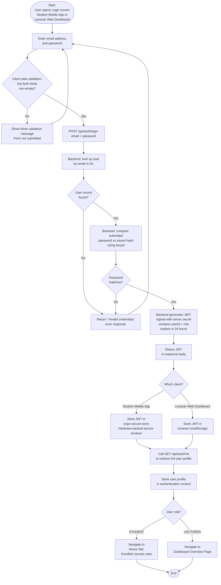

---

## 11. Flowchart 4 — Report Generation

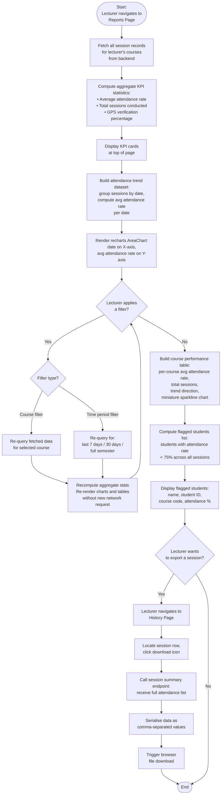

---

## 12. Entity Relationship Diagram (ERD)

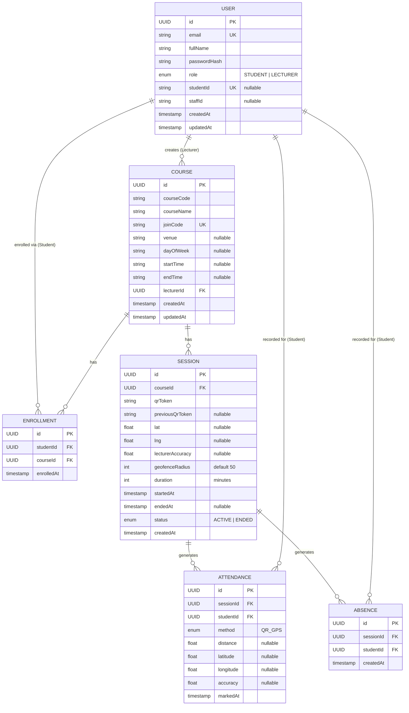

---

*End of Diagrams — Smart Attendance System*


Here are the three parts:

**Part 1 — QR Code Scanning**
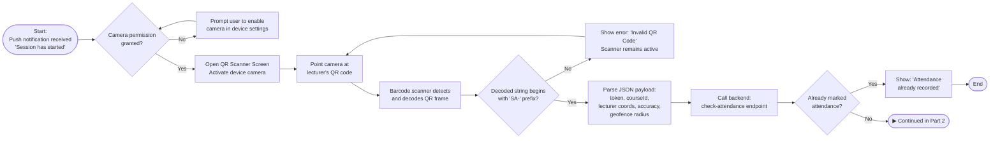

---

**Part 2 — GPS Verification**
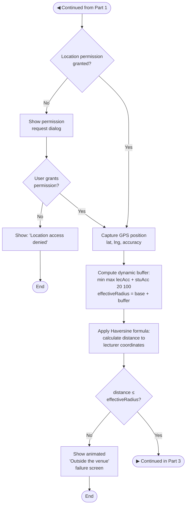

---

**Part 3 — Server Validation & Confirmation**
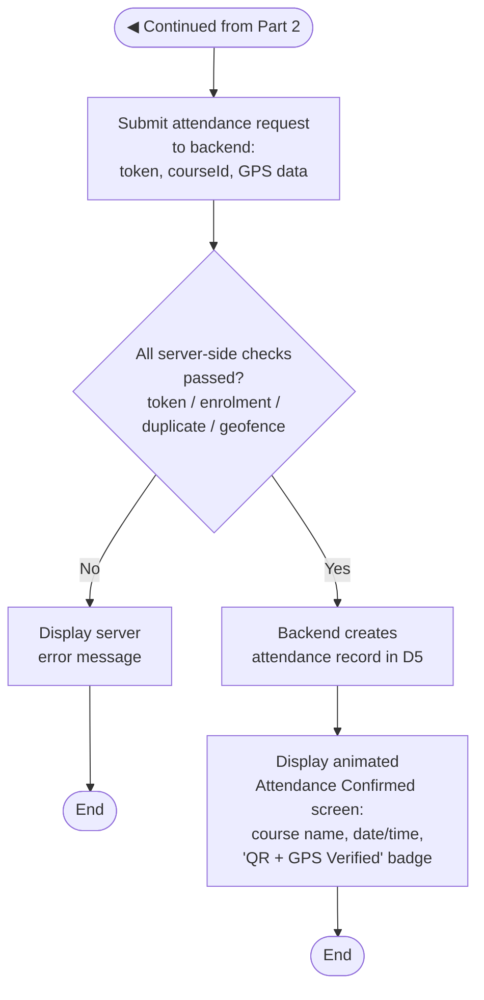